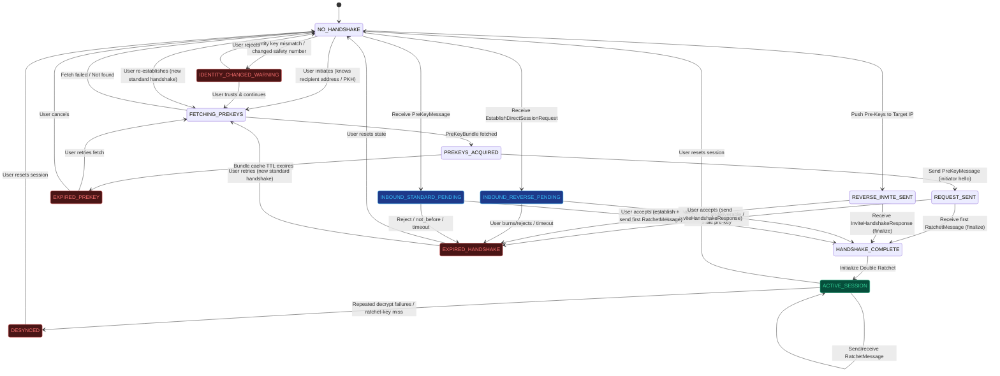

```mermaid
stateDiagram-v2
%% Define styles for specific states
classDef error fill:#4a1515,stroke:#f87171,color:#f87171
classDef active fill:#064e3b,stroke:#34d399,color:#34d399
classDef pending fill:#1e3a8a,stroke:#38bdf8,color:#38bdf8

    [*] --> NO_HANDSHAKE

    %% Notes
    %% - This diagram models the intended UX/security posture, not necessarily current implementation.
    %% - Standard Signal terminology is used (PreKeyBundle, PreKeyMessage, RatchetMessage).
    %% - Inbound handshake requests require explicit user acceptance.

    %% -----------------------------------------
    %% OUTBOUND FLOW: STANDARD (PKH)
    %% -----------------------------------------
    NO_HANDSHAKE --> FETCHING_PREKEYS : User initiates (knows recipient address / PKH)
    FETCHING_PREKEYS --> PREKEYS_ACQUIRED : PreKeyBundle fetched
    FETCHING_PREKEYS --> NO_HANDSHAKE : Fetch failed / Not found
    
    PREKEYS_ACQUIRED --> REQUEST_SENT : Send PreKeyMessage (initiator hello)
    PREKEYS_ACQUIRED --> EXPIRED_PREKEY : Bundle cache TTL expires
    EXPIRED_PREKEY --> FETCHING_PREKEYS : User retries fetch
    EXPIRED_PREKEY --> NO_HANDSHAKE : User cancels

    %% Standard Signal: initiator finalizes on responder's first RatchetMessage.
    %% Percolator may carry responder material in a dedicated response, but the conceptual state change is the same.
    REQUEST_SENT --> HANDSHAKE_COMPLETE : Receive first RatchetMessage (finalize)
    REQUEST_SENT --> EXPIRED_HANDSHAKE : Timeout / undeliverable / stale pre-key

    %% -----------------------------------------
    %% OUTBOUND FLOW: REVERSE (IP/DNS)
    %% -----------------------------------------
    NO_HANDSHAKE --> REVERSE_INVITE_SENT : Push Pre-Keys to Target IP
    REVERSE_INVITE_SENT --> HANDSHAKE_COMPLETE : Receive InviteHandshakeResponse (finalize)
    REVERSE_INVITE_SENT --> EXPIRED_HANDSHAKE : Target unreachable / Timeout

    %% -----------------------------------------
    %% INBOUND FLOW
    %% -----------------------------------------
    NO_HANDSHAKE --> INBOUND_REVERSE_PENDING : Receive EstablishDirectSessionRequest
    INBOUND_REVERSE_PENDING --> HANDSHAKE_COMPLETE : User accepts (send InviteHandshakeResponse)
    INBOUND_REVERSE_PENDING --> EXPIRED_HANDSHAKE : User burns/rejects / timeout

    NO_HANDSHAKE --> INBOUND_STANDARD_PENDING : Receive PreKeyMessage
    INBOUND_STANDARD_PENDING --> HANDSHAKE_COMPLETE : User accepts (establish + send first RatchetMessage)
    INBOUND_STANDARD_PENDING --> EXPIRED_HANDSHAKE : Reject / not_before / timeout

    %% Identity safety
    NO_HANDSHAKE --> IDENTITY_CHANGED_WARNING : Identity key mismatch / changed safety number
    IDENTITY_CHANGED_WARNING --> NO_HANDSHAKE : User rejects
    IDENTITY_CHANGED_WARNING --> FETCHING_PREKEYS : User trusts & continues

    %% -----------------------------------------
    %% ACTIVE SESSION & HEALING
    %% -----------------------------------------
    HANDSHAKE_COMPLETE --> ACTIVE_SESSION : Initialize Double Ratchet
    ACTIVE_SESSION --> ACTIVE_SESSION : Send/receive RatchetMessage
    ACTIVE_SESSION --> DESYNCED : Repeated decrypt failures / ratchet-key miss
    ACTIVE_SESSION --> NO_HANDSHAKE : User resets session
    DESYNCED --> NO_HANDSHAKE : User resets session
    NO_HANDSHAKE --> FETCHING_PREKEYS : User re-establishes (new standard handshake)

    %% -----------------------------------------
    %% CLEANUP
    %% -----------------------------------------
    EXPIRED_HANDSHAKE --> NO_HANDSHAKE : User resets state
    EXPIRED_HANDSHAKE --> FETCHING_PREKEYS : User retries (new standard handshake)

class EXPIRED_PREKEY error
class EXPIRED_HANDSHAKE error
class DESYNCED error
class IDENTITY_CHANGED_WARNING error
class ACTIVE_SESSION active
class INBOUND_REVERSE_PENDING pending
class INBOUND_STANDARD_PENDING pending
```