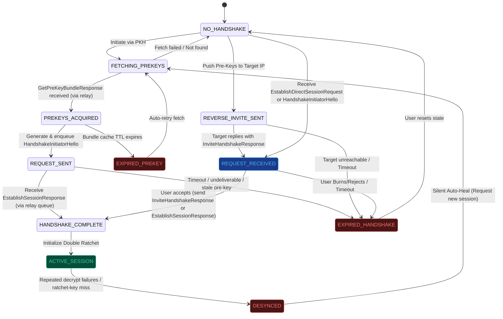

```mermaid
stateDiagram-v2
%% Define styles for specific states
classDef error fill:#4a1515,stroke:#f87171,color:#f87171
classDef active fill:#064e3b,stroke:#34d399,color:#34d399
classDef pending fill:#1e3a8a,stroke:#38bdf8,color:#38bdf8

    [*] --> NO_HANDSHAKE

    %% -----------------------------------------
    %% OUTBOUND FLOW: STANDARD (PKH)
    %% -----------------------------------------
    NO_HANDSHAKE --> FETCHING_PREKEYS : Initiate via PKH
    FETCHING_PREKEYS --> PREKEYS_ACQUIRED : GetPreKeyBundleResponse received (via relay)
    FETCHING_PREKEYS --> NO_HANDSHAKE : Fetch failed / Not found
    
    PREKEYS_ACQUIRED --> REQUEST_SENT : Generate & enqueue HandshakeInitiatorHello
    PREKEYS_ACQUIRED --> EXPIRED_PREKEY : Bundle cache TTL expires
    EXPIRED_PREKEY --> FETCHING_PREKEYS : Auto-retry fetch

    REQUEST_SENT --> HANDSHAKE_COMPLETE : Receive EstablishSessionResponse (via relay queue)
    REQUEST_SENT --> EXPIRED_HANDSHAKE : Timeout / undeliverable / stale pre-key

    %% -----------------------------------------
    %% OUTBOUND FLOW: REVERSE (IP/DNS)
    %% -----------------------------------------
    NO_HANDSHAKE --> REVERSE_INVITE_SENT : Push Pre-Keys to Target IP
    REVERSE_INVITE_SENT --> REQUEST_RECEIVED : Target replies with InviteHandshakeResponse
    REVERSE_INVITE_SENT --> EXPIRED_HANDSHAKE : Target unreachable / Timeout

    %% -----------------------------------------
    %% INBOUND FLOW
    %% -----------------------------------------
    NO_HANDSHAKE --> REQUEST_RECEIVED : Receive EstablishDirectSessionRequest or HandshakeInitiatorHello
    REQUEST_RECEIVED --> HANDSHAKE_COMPLETE : User accepts (send InviteHandshakeResponse or EstablishSessionResponse)
    REQUEST_RECEIVED --> EXPIRED_HANDSHAKE : User Burns/Rejects / Timeout

    %% -----------------------------------------
    %% ACTIVE SESSION & HEALING
    %% -----------------------------------------
    HANDSHAKE_COMPLETE --> ACTIVE_SESSION : Initialize Double Ratchet
    ACTIVE_SESSION --> DESYNCED : Repeated decrypt failures / ratchet-key miss
    DESYNCED --> FETCHING_PREKEYS : Silent Auto-Heal (Request new session)

    %% -----------------------------------------
    %% CLEANUP
    %% -----------------------------------------
    EXPIRED_HANDSHAKE --> NO_HANDSHAKE : User resets state

class EXPIRED_PREKEY error
class EXPIRED_HANDSHAKE error
class DESYNCED error
class ACTIVE_SESSION active
class REQUEST_RECEIVED pending
```